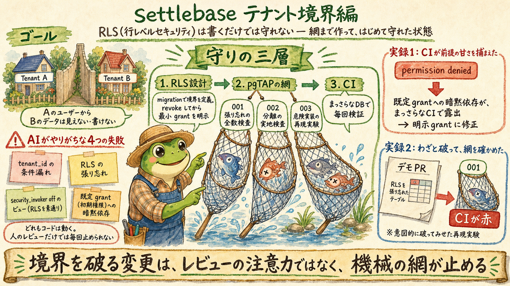

# settlebase

マルチテナント社内精算・ウォレット基盤の公開デモ。

デモ: <https://settlebase-sandy.vercel.app>

AI 開発ハーネス連載（Zenn）のデモリポジトリとして、プロダクト本体だけでなく
開発ハーネス（devlog / ADR / GLOSSARY / CI）をまるごと公開する。

## Problem

- 複数のテナント（組織）が同居する精算・ウォレット基盤では、テナント境界の破れがそのまま事故になる
- AI に実装を任せる開発では、境界の破れが静かに混入しやすい

## Solution

- Postgres RLS をテナント境界の最後の砦にする構成
- 境界を検証する認可テスト
- 開発ハーネス（devlog / ADR / GLOSSARY / CI）ごと公開し、連載で解説する

## Status

**スキーマ・RLS・認可テストを実装済み**（tenants / members / wallets +
テナント分離ポリシー + pgTAP。CI の db-tests で検証）。
デモ URL はまだテンプレートの初期画面のみで、UI は次のマイルストーン。
このリポジトリは連載と並行して段階的に育てる方針のため、
進捗と設計判断は docs/devlog/ と docs/adr/ を参照。

## 連載とここまでの歩み

最新の弾のグラレコ（弾ごとに差し替え）:



| 弾 | 内容 | 記事 | devlog | グラレコ |
|----|------|------|--------|---------|
| 第1弾 | 立ち上げ: 構想から 1 日で公開 | [Zenn](https://zenn.dev/syommy_program/articles/settlebase-launch-devlog) | [2026-07-18-launch](docs/devlog/2026-07-18-launch.md) | [PNG](docs/devlog/assets/2026-07-18-launch.png) |
| 第2弾 | テナント境界: RLS × pgTAP × CI の三層 | 執筆中 | [2026-07-19-tenant-boundary](docs/devlog/2026-07-19-tenant-boundary.md) | [PNG](docs/devlog/assets/2026-07-19-tenant-boundary.png) |

## Out of Scope（やらないこと）

- **実決済は扱わない**。実マネーの入出金・決済 API 連携は本デモの対象外
- 本番運用を想定したサポート・SLA はない

## Tech Stack

- Next.js (App Router) — `web/`
- Supabase (Auth + Postgres RLS)
- Vercel（Root Directory = `web/`）

## リポジトリ構成

```text
settlebase/
├── web/        # Next.js アプリ（アプリ都合のファイルはここに閉じる）
├── supabase/   # スキーマ migration・RLS・pgTAP 認可テスト
├── docs/
│   ├── devlog/ # 開発ログ（YYYY-MM-DD-topic.md）
│   │   └── assets/ # 連載グラレコ（devlog と同名・時系列）
│   └── adr/    # 設計判断の記録（MADR-lite）
├── scripts/    # 境界チェック等の運用スクリプト
├── GLOSSARY.md # 用語集（定義 + Avoid）
└── LICENSE     # MIT
```

開発ツールはこの repo に同居させず、独立リポジトリとして公開する
（beads 進捗ビューアは [beadmap](https://github.com/syotakokichi/beadmap)）。
ドメイン無関係のツールを混ぜず、repo の説明を精算基盤に集中させるための分離。

## 開発

```bash
cd web
npm install
npm run dev
```

環境変数は `web/.env.example` を参照する（`.env` はコミットしない）。

## License

MIT
