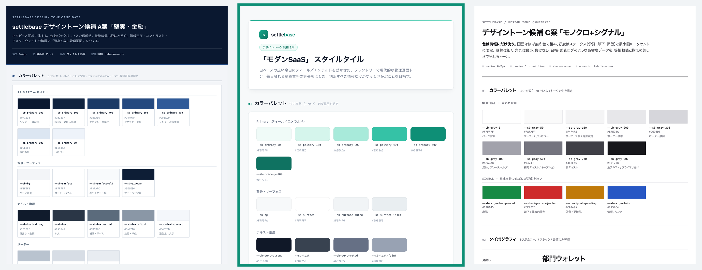

# settlebase デザインシステム

UI 設計（2026-07-20）で確定したデザイントークンと使用ルールの一次ソース。
Claude Design 上のデザインシステムプロジェクト（settlebase-ds）へ同期したトークン体系を、
repo 側の永続版として書き起こしたもの（同期したコンポーネントプレビュー 7 点そのものは
Claude Design 側にあり、repo には含まれない）。
実装時は本ファイルのトークンを Tailwind テーマ / CSS 変数に反映する（反映は後続タスク）。

## トーンの決定過程

3 方向の候補（A: 堅実・金融 = ネイビー高コントラスト / B: モダン SaaS = ティール・余白広め /
C: モノクロ+シグナル = 無彩色+ステータス色のみ）を比較し、**B 案「モダン SaaS」を採用**。
採用理由: 親しみやすさとオーナーのブランド感覚に合うこと（比較・採用の記録は
[devlog](../devlog/2026-07-20-ui-design.md) を参照）。

## カラートークン

### Primary（ティール）

| トークン | HEX | 用途 |
| --- | --- | --- |
| `--sb-primary-50` | `#F0FBF8` | 行ホバー・淡い強調背景 |
| `--sb-primary-100` | `#D5F5EC` | 選択中ナビ背景・アイコンチップ |
| `--sb-primary-200` | `#A8EADA` | フォーカスリング・強調ボーダー |
| `--sb-primary-300` | `#6ED9C2` | 確認ボックスのボーダー |
| `--sb-primary-400` | `#35C2A6` | 装飾ドット |
| `--sb-primary-500` | `#17A98C` | グラフ・アクセント |
| `--sb-primary-600` | `#0E8F76` | **主ボタン・リンク（基準色）** |
| `--sb-primary-700` | `#0F7261` | ボタン hover・選択中テキスト |
| `--sb-primary-800` | `#115A4E` | 濃色強調 |

### 背景・サーフェス・ボーダー

| トークン | HEX | 用途 |
| --- | --- | --- |
| `--sb-bg` | `#F7F9FA` | ページ背景 |
| `--sb-surface` | `#FFFFFF` | カード・テーブル背景 |
| `--sb-surface-muted` | `#F1F4F6` | テーブルヘッダ・無効ボタン |
| `--sb-surface-inset` | `#E9EEF1` | アバター背景等の沈み込み |
| `--sb-border` | `#E4E9EC` | 標準ボーダー・区切り線 |
| `--sb-border-strong` | `#CDD5DB` | 入力欄・押せる要素のボーダー |
| `--sb-ring` | `#A8EADA` | フォーカスリング |

### テキスト

| トークン | HEX | 用途 |
| --- | --- | --- |
| `--sb-text-strong` | `#101828` | 見出し・金額 |
| `--sb-text` | `#384250` | 本文 |
| `--sb-text-muted` | `#667085` | 補足・ラベル |
| `--sb-text-faint` | `#98A2B3` | 注記・プレースホルダ |
| `--sb-text-invert` | `#FFFFFF` | 濃色ボタン上の文字 |

### ステータス色（文字色 / 背景のペアで使う）

| トークン | 文字 | 背景 | 用途 |
| --- | --- | --- | --- |
| `approved` | `#0E8F76` | `#E3F8F1` | 承認済み |
| `rejected` | `#D93843` | `#FDECED` | 却下 |
| `pending` | `#B45D0C` | `#FCF1E3` | 保留中・承認待ち |
| `info` | `#1570B8` | `#E9F3FB` | 逆仕訳バッジ・準備金バッジ・ロールバッジ |
| `draft` | `#667085` | `#F1F4F6` | 下書き・取り下げ |

### Danger

| トークン | HEX | 用途 |
| --- | --- | --- |
| `--sb-danger-600` | `#D93843` | 却下ボタン・マイナス金額 |
| `--sb-danger-700` | `#B92832` | 却下ボタン hover |

## タイポグラフィ

| 用途 | 指定 |
| --- | --- |
| 和文・UI | システムフォントスタック（-apple-system, "Hiragino Sans", "Noto Sans JP" 系） |
| 数値・ID・メール | 等幅（ui-monospace 系）+ `font-variant-numeric: tabular-nums` |
| 見出し L / M / S | 24px/700・18px/700・15px/600（見出しは letter-spacing -0.01em） |
| 本文 / キャプション | 14px/400 lh1.7・12px/400 |

**金額は必ず等幅 + tabular-nums + 右揃え**（桁の縦位置を揃える）。

上表は実装時の目標スケール。2026-07-20 のワイヤー成果物は Claude Design が 1280px 基準で
出力したもので、実測はこれより 1〜2 段小さい（見出し L 20px / 本文・ナビ 13px /
補助 11〜12px）。実装で Tailwind テーマへ反映する際にどちらへ寄せるかは未確定
（[devlog §6](../devlog/2026-07-20-ui-design.md) の既知の残課題を参照）。

## 密度（レイアウト）

**基準ビューポート: 1280px 幅・デスクトップファースト**（[screen-specs](screen-specs.md) の
対応ビューポート方針に準拠）。以下は代表画面 [ledger.html](ledger.html) の実測値。

| 項目 | 値 | 用途 |
| --- | --- | --- |
| サイドバー幅 | 232px | 全画面共通シェル |
| コンテンツ余白 | 28px（上下） / 32px（左右） | メイン領域のページ内側 |
| カード内余白 | 12px 16px | カード・パネルのボックス |
| テーブル行余白 | 13px 16px | 台帳・一覧の行（行高 約 42px） |
| コントロール余白 | 9px 12px（標準） / 9px 16px（主ボタン） | ボタン・フィルタ・ナビ項目 |
| バッジ余白 | 2px 8px（標準） / 1px 6px（極小） | ステータス・逆仕訳・準備金 |
| 要素間ギャップ | 6px（密） / 10px（標準） / 16px（疎） | アイコン + ラベル / 行内 / セクション内 |
| セクション間マージン | 14px / 20px | フィルタ列・カード間 |
| アイコン・ドット | 16px / 20px（アイコン） / 6px（ステータスドット） | ナビ・アバター・バッジ |

「余白広め」の実装は、**行の高さではなく行間ギャップとカード余白で確保する**
（台帳・監査ログのような高密度テーブルは行高を詰め、周囲の余白で呼吸させる）。

## 主要コンポーネント

Claude Design の settlebase-ds へ同期した 7 点（foundations: colors / type、components:
buttons / badges / table / card / sidebar）の永続仕様。

| コンポーネント | 構造 | 状態 |
| --- | --- | --- |
| **ボタン（主）** | `--sb-primary-600` 背景 + `--sb-text-invert` / radius-s / 余白 9px 16px / weight 600 | hover = `--sb-primary-700` / disabled = `--sb-surface-muted` + `--sb-text-faint` |
| **ボタン（副）** | `--sb-surface` 背景 + `--sb-border-strong` 枠 + `--sb-text-strong` / radius-s | hover = `--sb-surface-muted` / focus = `--sb-ring` |
| **ボタン（danger）** | `--sb-danger-600` 背景 + `--sb-text-invert` | hover = `--sb-danger-700`。却下・破壊的操作のみ |
| **バッジ** | 先頭 6px 色ドット + テキスト / radius 999px / 余白 2px 8px | ステータス 5 種（approved / rejected / pending / info / draft）。色だけに頼らない |
| **テーブル** | ヘッダ = `--sb-surface-muted` / 行区切り = `--sb-border` 1px / 金額列は等幅 + tabular-nums + 右揃え / 末尾に集計行（`--sb-primary-50` 背景） | 行 hover = `--sb-primary-50` / 空状態は専用メッセージ + 導線 |
| **カード** | `--sb-surface` 背景 + `--sb-border` 枠 + radius-l + shadow-m / 内側余白 12px 16px | モーダルも同構造（背景オーバーレイ + shadow-m） |
| **サイドバー** | 幅 232px / 上部にテナント切替（枠付きボタン）/ ナビ項目 = アイコン 20px + ラベル 13px・余白 9px 12px・radius-s / 下部にログイン中メンバー + ロールバッジ | 選択中 = `--sb-primary-100` 背景 + `--sb-primary-700` 文字 + weight 600 / 非活性ロールの項目は非表示 |

## 形状・影

| トークン | 値 | 用途 |
| --- | --- | --- |
| `--sb-radius-s / m / l` | 8px / 10px / 12px | ボタン・入力 / 中間 / カード |
| `--sb-shadow-s` | `0 1px 2px rgba(16,24,40,.05)` | ボタン・フィルタ |
| `--sb-shadow-m` | shadow-s + `0 8px 24px -8px rgba(16,24,40,.08)` | カード・モーダル |

## 使用ルール

- **ステータスは色だけに頼らない**: バッジは必ずテキスト（承認済み / 却下 / 保留中…）とセット。バッジ先頭に 6px の色ドットを付ける
- **部門アバターは頭文字 1 字 + 背景色**（例: 開 / 営 / 総 / 準）。ただし**必ず部門名を併記**し、アバター単独では使わない。頭文字が衝突する部門が増えたら 2 文字に切り替える
- **破壊的操作の色**: 却下・削除系のみ danger 赤。承認・確定は primary
- **確認ステップ**: 記帳を伴う操作（承認・逆仕訳）は必ず確認ボックスを挟み、「取り消せない・訂正は逆仕訳」であることを文言で示す
- **権限注記**: ロールで制限される操作ボタンには「管理者のみ」等の小さな注記を添える（画面は代表ロール視点で描き、差分は注記で表現）

## 関連ファイル

- [screen-specs.md](screen-specs.md) — 画面要件仕様（画面別チェックリスト）
- [concept.md](concept.md) — システム全体像・記帳モデル（業務ルールの一次ソース）
- [devlog 2026-07-20](../devlog/2026-07-20-ui-design.md) — 設計過程の記録・適合表・境界チェック証跡
- [ds-tone-candidates.png](ds-tone-candidates.png) — トーン候補 3 案の比較（採用 = 中央 B 案）
- ワイヤーフレーム（本ディレクトリ）:
  [wire-01-wallets](wire-01-wallets.png) /
  [wire-02-request](wire-02-request.png) /
  [wire-03-approvals](wire-03-approvals.png) /
  [wire-04-ledger](wire-04-ledger.png) /
  [wire-04b-ledger-empty](wire-04b-ledger-empty.png) /
  [wire-05-audit](wire-05-audit.png) /
  [wire-06-roles](wire-06-roles.png) /
  [wire-06b-role-modal](wire-06b-role-modal.png)
- [ledger.html](ledger.html) — 代表画面（台帳）の静的スナップショット。`wire-04-ledger.png` の仕上げ版で、本ファイルの密度実測値の出所
